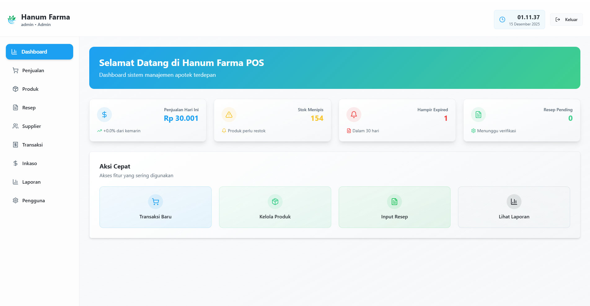
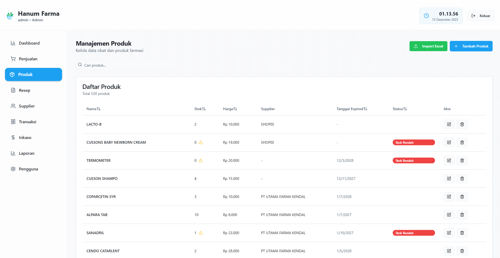
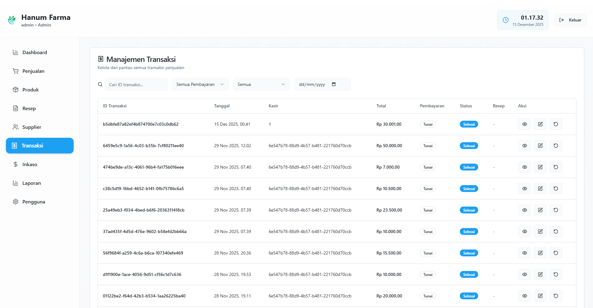
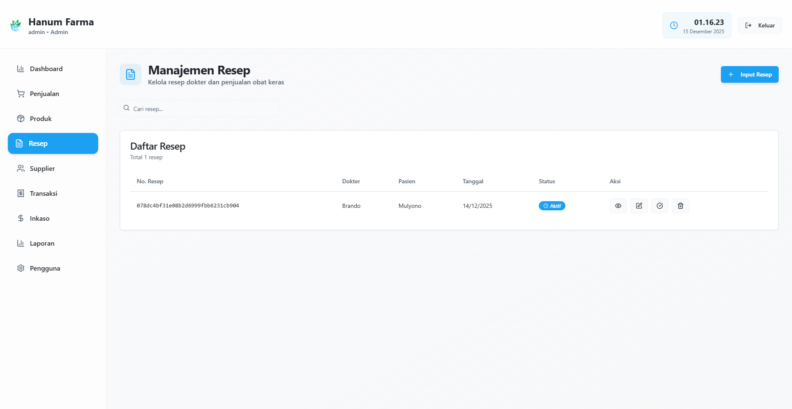
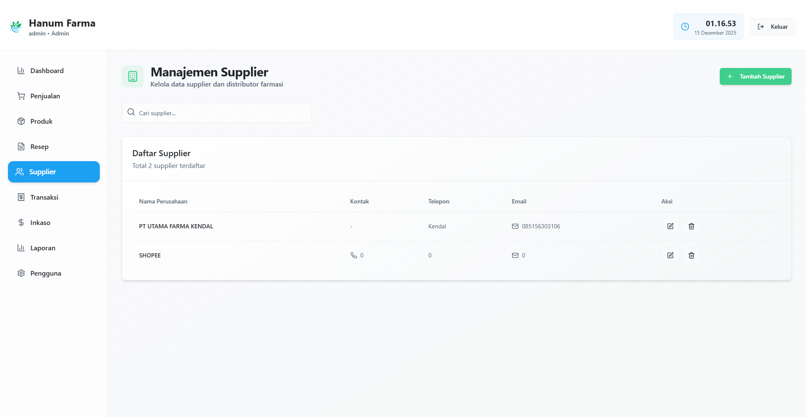
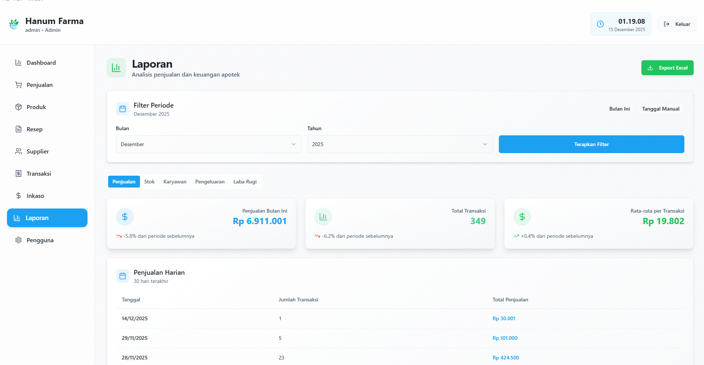
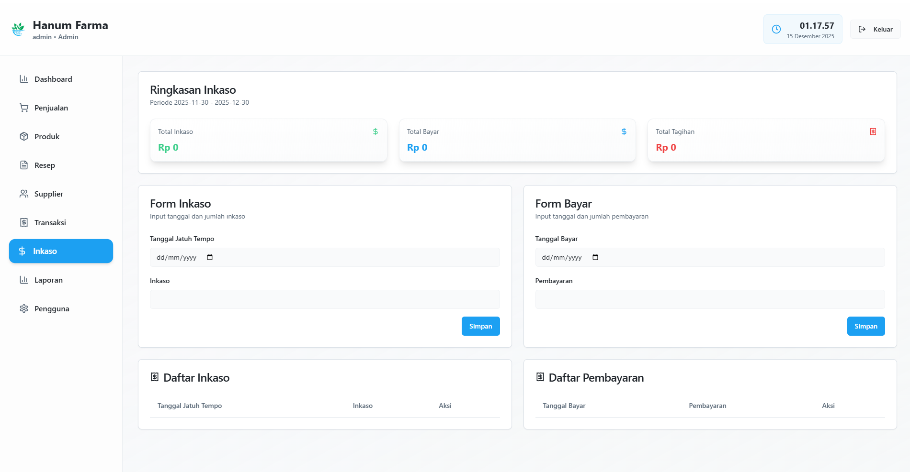
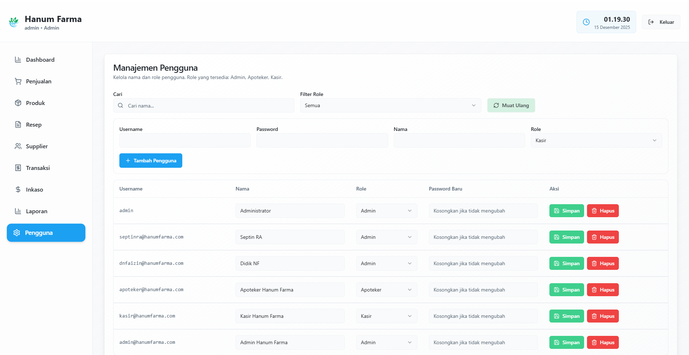

# Hanum Farma - Sistem Manajemen Apotek

## Deskripsi Proyek

Hanum Farma adalah aplikasi desktop untuk manajemen apotek yang dibangun menggunakan Electron, React, dan Express. Aplikasi ini memungkinkan pengelolaan inventaris obat, penjualan, resep dokter, dan laporan keuangan dalam satu sistem terintegrasi.

## Fitur Utama

- **Manajemen Pengguna**: Pengelolaan akun pengguna dengan berbagai tingkat akses
- **Manajemen Produk**: Pencatatan dan pengelolaan stok obat dan produk kesehatan
- **Manajemen Supplier**: Pengelolaan data supplier dan pemesanan produk
- **Penjualan**: Antarmuka kasir untuk transaksi penjualan dengan dan tanpa resep
- **Transaksi**: Pencatatan dan pengelolaan transaksi penjualan
- **Manajemen Resep**: Pencatatan dan pengelolaan resep dokter
- **Laporan**: Pembuatan laporan penjualan dan keuangan

## Screenshot Aplikasi

Berikut adalah tampilan antarmuka Hanum Farma:

### Dashboard
*Tampilan utama dashboard dengan ringkasan data penjualan dan statistik*


### Manajemen Produk
*Halaman pengelolaan produk obat dan item kesehatan*


### Penjualan
*Antarmuka kasir untuk transaksi penjualan*


### Transaksi
*Daftar transaksi penjualan yang telah dilakukan*


### Manajemen Resep
*Pencatatan dan pengelolaan resep dari dokter*


### Manajemen Supplier
*Pengelolaan data supplier dan pemasok produk*


### Laporan
*Sistem pelaporan penjualan dan keuangan*


### Inkaso
*Pencatatan pembayaran dan inkaso*


### Manajemen User
*Pengelolaan akun pengguna dan hak akses*


## Kredensial Default

- **Username**: `admin`
- **Password**: `1234`

## Role

- **Admin**: Hak akses penuh ke semua fitur
- **Kasir**: Hak akses untuk transaksi penjualan dan tanpa resep
- **Apoteker**: Hak akses untuk mengelola produk, penjualan, dan resep. 

## Teknologi yang Digunakan

- **Frontend**: React, TypeScript, Vite, Tailwind CSS, shadcn-ui
- **Backend**: Express.js
- **Database**: SQLite
- **Aplikasi Desktop**: Electron
- **Bundler**: Vite

## Database location

- **Database**: `%appdata%/HanumFarma/data.db` (Gunakan DB Browser for SQLite)

## Struktur Proyek

- `/src`: Kode sumber frontend React
- `/electron`: Kode sumber aplikasi Electron
  - `/electron/server`: Server Express terintegrasi
- `/server`: Server Express untuk pengembangan

## Cara Menjalankan Aplikasi

## Download Aplikasi

Anda dapat mengunduh versi terbaru aplikasi Hanum Farma dari:
[https://github.com/vianlearns/POS-Apotek/releases](https://github.com/vianlearns/POS-Apotek/releases)

### Mode Pengembangan

```sh
# Instal dependensi
npm install

# Jalankan aplikasi dalam mode pengembangan
npm run electron:dev
```

### Build Aplikasi

```sh
# Build aplikasi untuk platform saat ini
npm run electron:build
```

or

```sh
npm run dist
```

## Kontribusi

Untuk berkontribusi pada proyek ini:

1. Fork repositori
2. Buat branch fitur baru (`git checkout -b fitur-baru`)
3. Commit perubahan Anda (`git commit -m 'Menambahkan fitur baru'`)
4. Push ke branch (`git push origin fitur-baru`)
5. Buat Pull Request baru

## Lisensi

Hak Cipta © 2025 Hanum Farma. Seluruh hak dilindungi.
